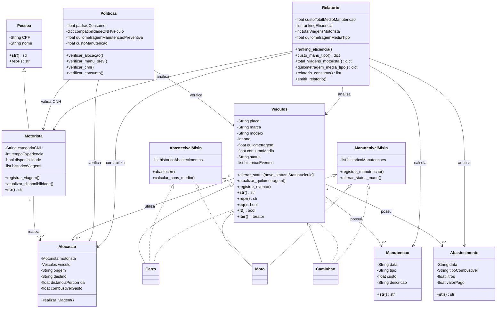

# MiniProjeto---POO

---

## Projeto do curso de Engenharia de Software da UFCA

---

## Descrição do projeto

### Tema 2: Sistema de Gerenciamento de frotas de veículos

#### Visão Geral:

Desenvolver um sistema de linha de comando (CLI) ou uma API mínima (FastAPI ou Flask, opcional) para gerenciar a frota de veículos de uma empresa de transporte.
O sistema deve permitir o cadastro de veículos, controle de manutenções, alocação a motoristas, registro de abastecimentos, cálculo de custos médios e relatórios de desempenho. O sistema deve aplicar conceitos de encapsulamento, herança (simples e múltipla), métodos especiais, regras de negócio configuráveis. A persistência pode ser feita em JSON ou SQLite, com um repositório desacoplado do domínio.

---
## Modelagem OO

### UML textual:

> #### Classe: Veículos
>
> ##### Atributos:
> - Placa: str;
> - Marca: str;
> - Modelo: str;
> - Ano: int;
> - Quilometragem: float;
> - Consumo Médio (Km/L): float;
> - Status (ativo, manutenção, inativo);
> - Histórico de eventos: list.
> 
> ##### Métodos:
> - alterar_status(novo_status: StatusVeiculo): void;
> - atualizar_quilometragem(): void;
> - registrar_evento(): void;
> - __str__(): str;
> - __repr__(): str;
> - __eq__(): bool;
> - __lt__(): bool;
> - __iter__(): Iterator.

> #### Classe: Pessoa
> 
> ##### Atributos:
> - CPF: str;
> - Nome: str.
> 
> ##### Métodos:
> - __str__();
> - __repr__().

> #### Classe: Alocação
> 
> ##### Atributos:
> - Motorista: Motorista;
> - Veículo: Veículo;
> - Origem: str;
> - Destino: str;
> - Distância percorrida: float;
> - Combustível gasto: float.
> 
> ##### Métodos:
> - realizar_viagem( ).

> #### Classe: Manutenção
> 
> ##### Atributos:
> - Data: str;
> - Tipo (preventiva ou corretiva);
> - Custo: float;
> - Descrição: str.
> 
> ##### Métodos:
> - __str__().

> #### Classe: Abastecimento
> 
> ##### Atributos:
> - Data: str;
> - Tipo de combustível: str;
> - Litros: float;
> - Valor pago: float.
> 
> ##### Métodos:
> - __str__().

> #### Classe: Políticas
> 
> ##### Atributos:
> - Padrão de consumo: float;
> - Compatibilidade CNH-Veículo: dict;
> - Quilometragem para manutenção preventiva: float;
> - Custo de manutenção: float.
> 
> ##### Métodos:
> - verificar_alocacao( );
> - verificar_manu_prev( );
> - verificar_cnh( );
> - verificar_consumo().

> #### Classe: Relatório
> 
> ##### Atributos:
> - Custo total e médio de manutenção por tipo de veículo: float;
> - Ranking de eficiência: list;
> - Total de viagens por motorista: int;
> - Quilometragem média por tipo de veículo: float
> 
> ##### Métodos:
> - ranking_eficiencia( );
> - custo_manu_tipo(): dict;
> - total_viagens_motorista(): dict;
> - quilometragem_media_tipo(): dict;
> - relatorio_consumo(): list
> - emitir_relatorio( ).

> #### Classe: Motorista (*É uma pessoa*)
> 
> ##### Atributos:
> - Categoria CNH: str;
> - Tempo de experiência: int;
> - Disponibilidade: bool;
> - Histórico de viagens.
> 
> ##### Métodos:
> - registrar_viagem();
> - atualizar_disponibilidade();
> - __str__().

> #### Classe: Carro (*É um veículo*)
> 
> ##### Atributos:
> 
> 
> ##### Métodos:

> #### Classe: Moto (*É um veículo*)
>
> ##### Atributos:
>
> 
> ##### Métodos:

> #### Classe: Caminhão (*É um veículo*)
> 
> ##### Atributos:
> 
> 
> ##### Métodos:

> #### Classe: AbastecivelMixin
>
> ##### Atributos:
> - Histórico de abastecimentos: list.
>
> ##### Métodos:
> - abastecer();
> - calcular_cons_medio().

> #### Classe: ManutenivelMixin
>
> ##### Atributos:
> - Histórico de manutenções: list.
>
> ##### Métodos:
> - registrar_manutenção();
> - alterar_status_manu().

#### Diagrama UML gerado a partir das informações acima:

