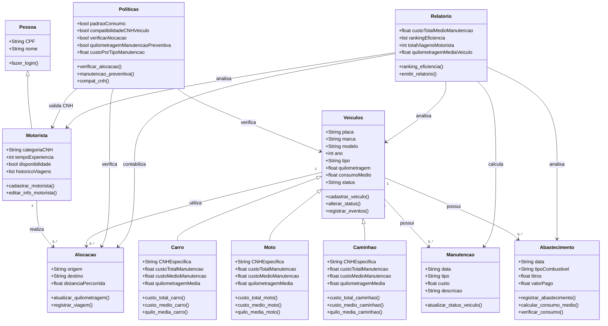

# MiniProjeto---POO

---

## Projeto do curso de Engenharia de Software da UFCA

---

## Descrição do projeto

### Tema 2: Sistema de Gerenciamento de frotas de veículos

#### Visão Geral:

Desenvolver um sistema de linha de comando (CLI) ou uma API mínima (FastAPI ou Flask, opcional) para gerenciar a frota de veículos de uma empresa de transporte.
O sistema deve permitir o cadastro de veículos, controle de manutenções, alocação a motoristas, registro de abastecimentos, cálculo de custos médios e relatórios de desempenho. O sistema deve aplicar conceitos de encapsulamento, herança (simples e múltipla), métodos especiais, regras de negócio configuráveis. A persistência pode ser feita em JSON ou SQLite, com um repositório desacoplado do domínio.

---
## Modelagem OO

### UML textual:

> #### Classe: Veículos
>
> ##### Atributos:
> - Placa: str;
> - Marca: str;
> - Modelo: str;
> - Ano: int;
> - Tipo (carro, moto, caminhão): str;
> - Quilometragem: float;
> - Consumo Médio (Km/L): float;
> - Status (ativo, manutenção, inativo).
> 
> ##### Métodos:
> - cadastrar_veículo( );
> - alterar_status( ):
> - registrar_eventos( ).

> #### Classe: Pessoa
> 
> ##### Atributos:
> - CPF: str;
> - Nome: str.
> 
> ##### Métodos:
> - fazer_login( ).

> #### Classe: Alocação
> 
> ##### Atributos:
> - Origem: str;
> - Destino: str;
> - Distância percorrida: float.
> 
> ##### Métodos:
> - atualizar_quilometragem( );
> - registrar_viagem( ).

> #### Classe: Manutenção
> 
> ##### Atributos:
> - Data: str;
> - Tipo (preventiva ou corretiva);
> - Custo: float;
> - Descrição: str.
> 
> ##### Métodos:
> - atualizar_status_veículo( ).

> #### Classe: Abastecimento
> 
> ##### Atributos:
> - Data: str;
> - Tipo de combustível: str;
> - Litros: float;
> - Valor pago: float.
> 
> ##### Métodos:
> - registrar_abastecimento( );
> - calcular_consumo_medio( );
> - verificar_consumo( ).

> #### Classe: Políticas
> 
> ##### Atributos:
> - Padrão de consumo: bool;
> - Compatibilidade CNH-Veículo: bool;
> - Verificar alocação: bool;
> - Quilometragem para manutenção preventiva: bool;
> - Custo por tipo de manutenção: float.
> 
> ##### Métodos:
> - verificar_alocacao( );
> - manutencao_preventiva( );
> - compat_cnh( ).

> #### Classe: Relatório
> 
> ##### Atributos:
> - Custo total e médio de manutenção por tipo de veículo: float;
> - Ranking de eficiência: list;
> - Total de viagens por motorista: int;
> - Quilometragem média por tipo de veículo: float
> 
> ##### Métodos:
> - ranking_eficiencia( );
> - emitir_relatorio( ).

> #### Classe: Motorista (*É uma pessoa*)
> 
> ##### Atributos:
> - Categoria CNH: str;
> - Tempo de experiência: int;
> - Disponibilidade: bool;
> - Histórico de viagens.
> 
> ##### Métodos:
> - cadastrar_motorista( );
> - editar_info_motorista( );

> #### Classe: Carro (*É um veículo*)
> 
> ##### Atributos:
> - CNH específica: str;
> - Custo total e médio de manutenção: float;
> - Quilometragem média: float.
> 
> ##### Métodos:
> - custo_total_carro( );
> - custo_medio_carro( );
> - quilo_media_carro( );

> #### Classe: Moto (*É um veículo*)
>
> ##### Atributos:
> - CNH específica: str;
> - Custo total e médio de manutenção: float;
> - Quilometragem média: float
> 
> ##### Métodos:
> - custo_total_moto( );
> - custo_medio_moto( );
> - quilo_media_moto( );

> #### Classe: Caminhão (*É um veículo*)
> 
> ##### Atributos:
> - CNH específica: str;
> - Custo total e médio de manutenção: float;
> - Quilometragem média: float
> 
> ##### Métodos:
> - custo_total_caminhao( );
> - custo_medio_caminhao( );
> - quilo_media_caminhao( ); 

#### Diagrama UML gerado a partir das informações acima:

